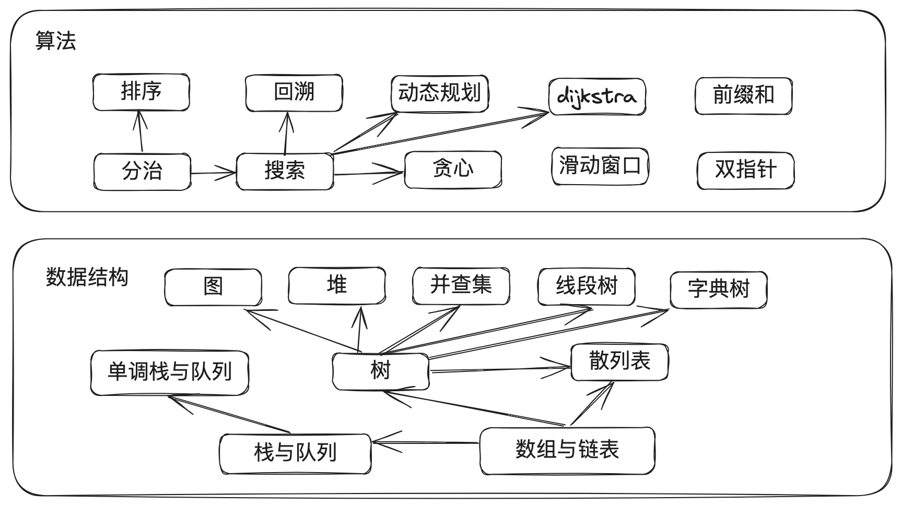

# algorithm-note

## 算法

**数据结构就像是建材，是构建软件系统的基础**。就像建筑物需要不同类型的建材来支撑和组织一样，软件系统也需要数据结构来存储和组织数据。

**算法则可以类比为规划设计图，它们是为了解决问题而存在的**。就像规划设计图指导建筑师在建筑物上进行施工和安排，算法指导程序员在数据结构上进行操作和处理。

因此，数据结构和算法之间的关系可以说是密不可分的。数据结构提供了存储和组织数据的基础，而算法则提供了操作和处理数据的指导。在软件开发中，合理选择和使用适当的数据结构和算法，可以提高程序的效率和性能。



</br>

## 复杂度分析

在算法设计中，我们先后追求以下两个层面的目标。

1. **找到问题解法**：算法需要在规定的输入范围内，可靠地求得问题的正确解。
2. **寻求最优解法**：同一个问题可能存在多种解法，我们希望找到尽可能高效的算法。

也就是说，在能够解决问题的前提下，算法效率已成为衡量算法优劣的主要评价指标，它包括以下两个维度。

- **时间效率**：算法运行速度的快慢。
- **空间效率**：算法占用内存空间的大小。
  
简而言之，**我们的目标是设计“既快又省”的数据结构与算法**。而有效地评估算法效率至关重要，因为只有这样我们才能将各种算法进行对比，从而指导算法设计与优化过程。

### 时间复杂度

**Big O表示法**: 大O表达式是我们描述时间复杂度最常用的方法，大写字母“O”后面跟一个函数来表示算法的上界，即最坏情况下的运行时间。

另外还有**Ω (Omega) 表示法**和 **Θ (Theta) 表示法**。 其中Ω表示算法的下界，即算法的最佳情况时间复杂度；Θ表示算法的平均情况时间复杂度。
这两种方法在算法分析中用得比较少，我们主要还是使用大O表示法。

我们假设算法的操作数量是一个关于输入数据大小n的函数，记为T(n), 当我们编写完算法代码后, 开始对代码逐行累计操作数量，得到如下示例的一个表达式:

```rust
fn algorithm(n: i32) {
    let mut a = 1;   // +1
    a = a + 1;      // +1
    a = a * 2;      // +1

    // 循环 n 次
    for _ in 0..n { // +1（每轮都执行 i ++）
        println!("{}", 0); // +1
    }
}
```

上面算法的T(n) = 3 + 2n

同时，T(n)中的常数和系数可以忽略，比如2n和n其实表示的是同一个数量级，对时间复杂度并没有影响。所以可以总结出以下计数简化技巧:

1. 忽略T(n)中的常数项。因为它们都与n无关，对时间复杂度无影响。
2. 忽略T(n)中的系数。例如，循环2n次、5n + 1次等，都可以简化为n次，因为n前面的系数对时间复杂度没有影响。
3. 循环嵌套时使用乘法。总操作数量等于外层循环和内层循环操作数量之积，每一层循环可以再套用上面两条简化规则。
4. 递归遍历是使用阶乘。总操作数等于分裂的每一层操作数之和, 第k层的操作数为b^k,b是分裂的次数: $$\sum_{k=0}^{n} b^k$$

于是我们可以看到上面示例代码最终的时间复杂度为O(n)。 T(n) = 3 + 2n 应用技巧后 T(n) = O(n)。

根据输入数据大小为n，常见的时间复杂度类型如下所示:

$$
\begin{aligned}
O(1) < O(\log n) < O(n) < O(n \log n) < O(n^2) < O(2^n) < O(n!) \newline
\text{常数阶} < \text{对数阶} < \text{线性阶} < \text{线性对数阶} < \text{平方阶} < \text{指数阶} < \text{阶乘阶}
\end{aligned}
$$

### 空间复杂度

一般情况下，统计算法空间复杂度主要是计算参数、暂存空间、返回值的内存占用，其中暂存空间包括各种临时变量、数组、堆栈等辅助空间。

空间复杂度的计算方法和时间复杂度类似，也是用大O表示法，但是它表示的是算法的存储空间的需求量。

1. 常数阶\(O(1)\): 主要统计的是与输入数据大小n无关的常量、变量和对象，比如在函数中申请10000字节的数组，但是与n无关，其空间复杂度还是常数阶。
2. 线性阶\(O(n)\): 主要统计的是与n成正比的数组、链表、栈、队列等等。
3. 平方阶\(O(n^2)\): 主要统计的是与n成正比的二维数组、图等等。
4. 指数阶\(O(2^n)\): 主要统计的是与n成正比的二叉树、递归算法等等。
5. 对数阶\(O(\log n)\): 主要统计的是与n成正比的分治算法等等，比如归并排序。

### 平衡时间与空间

理想情况下，我们希望算法的时间复杂度和空间复杂度都能够达到最优，但是这通常是很困难的。所以在实际开发中，我们需要在时间复杂度和空间复杂度之间进行权衡，找到一个平衡点。有时需要根据不同的应用场景来决定是以时间换空间，还是以空间换时间。

</br>

## 数据结构类

### 数组与链表

- [数组与链表简要说明](./docs/数据结构篇/数组与链表/brief_introduction.md)
- [题解](./docs/数据结构篇/数组与链表/problems.md)

### 栈与队列

- [栈与队列简要说明](./docs/数据结构篇/栈与队列/brief_introduction.md)
- [题解](./docs/数据结构篇/栈与队列/problems.md)

### 单调栈与单调队列

- [单调栈与单调队列简要说明](./docs/数据结构篇/单调栈与单调队列/brief_introduction.md)
- [题解](./docs/数据结构篇/单调栈与单调队列/problems.md)

### 哈希表

- [哈希表简要说明](./docs/数据结构篇/哈希表/brief_introduction.md)
- [题解](./docs/数据结构篇/哈希表/problems.md)

### 树

- [树简要说明](./docs/数据结构篇/树/brief_introduction.md)
- [题解](./docs/数据结构篇/树/problems.md)

### 堆

### 图

### 并查集

### 线段树

</br>

## 算法类

### 双指针

- [双指针简要说明](./docs/算法篇/双指针/brief_introduction.md)
- [题解](./docs/算法篇/双指针/problems.md)

### 滑动窗口

### 前缀和

### 分治

### 排序

### 搜索

### 贪心

### 回溯

### 动态规划

### diljkstra

</br>

## 应用场景案例

### 大数据

### 金融

### 游戏

### 教育

</br>

## 参考资料

1. [labuladong的算法小抄](https://github.com/labuladong/fucking-algorithm)
2. [Hello算法](https://github.com/krahets/hello-algo)
3. [算法导论](https://jingyuexing.github.io/Ebook/Algorithm/%E7%AE%97%E6%B3%95%E5%AF%BC%E8%AE%BA.pdf)
