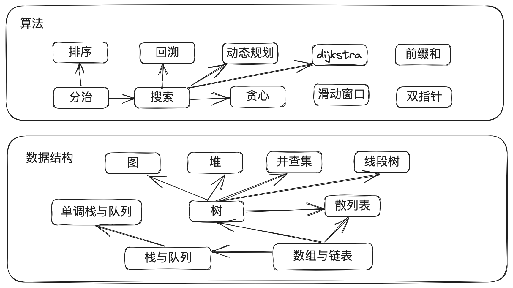

# algorithm-note

## 算法

**数据结构就像是建材，是构建软件系统的基础**。就像建筑物需要不同类型的建材来支撑和组织一样，软件系统也需要数据结构来存储和组织数据。

**算法则可以类比为规划设计图，它们是为了解决问题而存在的**。就像规划设计图指导建筑师在建筑物上进行施工和安排，算法指导程序员在数据结构上进行操作和处理。

因此，数据结构和算法之间的关系可以说是密不可分的。数据结构提供了存储和组织数据的基础，而算法则提供了操作和处理数据的指导。在软件开发中，合理选择和使用适当的数据结构和算法，可以提高程序的效率和性能。

## 复杂度分析

### 时间复杂度

### 空间复杂度

## 数据结构篇

## 算法篇

## 个人总结篇

## 参考资料

[labuladong的算法小抄](https://github.com/labuladong/fucking-algorithm)
[Hello算法](https://github.com/krahets/hello-algo)
[算法导论](https://jingyuexing.github.io/Ebook/Algorithm/%E7%AE%97%E6%B3%95%E5%AF%BC%E8%AE%BA.pdf)

