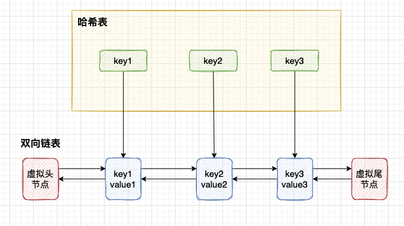

# 题解

## 217. 存在重复元素

> [题目描述](https://leetcode-cn.com/problems/contains-duplicate/)

**题目解法**: 该题目可以使用哈希表轻松解决，对于每一个元素，如果哈希表中不存在该元素，则将该元素加入哈希表中，否则返回`true`。

[rust版本](../../../codes/rust/217.存在重复元素.rs) |
[java版本](../../../codes/java/217.存在重复元素.java) |
[golang版本](../../../codes/golang/217.存在重复元素.go) |
[python](../../../codes/python/217.存在重复元素.py)

</br>

## 219. 存在重复元素 II

> [题目描述](https://leetcode-cn.com/problems/contains-duplicate-ii/)

**题目解法**: 该题目同样可以使用哈希表解决，对于每一个元素，如果哈希表中不存在该元素，则将该元素加入哈希表中，否则判断该元素与哈希表中该元素的下标差是否小于等于`k`，如果是则返回`true`，否则继续遍历。

[rust版本](../../../codes/rust/219.存在重复元素II.rs) |
[java版本](../../../codes/java/219.存在重复元素II.java) |
[golang版本](../../../codes/golang/219.存在重复元素II.go) |
[python](../../../codes/python/219.存在重复元素II.py)

</br>

## 1044. 最长重复子串

> [题目描述](https://leetcode-cn.com/problems/longest-duplicate-substring/)

**题目解法**:

一、暴力解决:

对于查找字符串中的最长重复子串，如果我们不考虑性能，那么我们可以针对所有子串进行判断(从该子串的开始索引到字符串的末尾，对比每一个等长的不同子串)，如果该子串在字符串中出现了多次，那么就对比其长度是不是最长，如果是则记录开始结束位置，知道判断完所有子串。

其中: 对于查找所有子串，其时间复杂度为`O(n^2)`，对于每一个子串的判断，因为是逐个子串逐个字符对比，所以时间复杂度为`O(n^2)`，所以总的时间复杂度为`O(n^4)`。
示例代码如下:

```python
start, end = 0, 0
max_len = 0
for i in range(len(s)):
 for j in range(i + 1, len(s)):
  # 子串s[i:j]
  step = 1
  is_duplicate = False
  # O(n)的时间复杂度判断子串是否重复
  for k in range(j + 1, len(s)):
   # 判断s[i:j]与s[i+step:k]是否相等
   if s[i:j] == s[i+step:k]:
	is_duplicate = True
	break
   step += 1
  # 如果子串重复，判断其长度是否最长
  if is_duplicate and j - i > max_len:
   start, end = i, j
   max_len = j - i
# 最后返回最长重复子串
return s[start:end]
```

二、二分查找:

在版本一中，我们对每一个子串都进行了判断，对此我们再进一步思考一下，对于一个长度为`a_len`的子串`a`:

- 如果它存在重复子串，那么长度比`a_len`更小的子串就没必要再搜索判断了，因为他们肯定不存在最长重复子串了
- 如果它不存在重复子串，那么比`a_len`更大的子串，也没有必要再继续搜索判断了，因为如果存在更长的重复子串，那么`a`肯定存在它的重复子串

所以我们优化为使用二分查找的思路来查找子串，同时，对比子串的判断，我们是逐个字符对比，这里我们可以优化为使用Rabin-Karp算法来对比子串，这样可以将判断子串的时间复杂度降低到`O(1)`，所以总的时间复杂度为`O(n^2logn)`。

**Rabin-Karp简要说明:**

Rabin-Karp算法是一种字符串匹配算法，采用了哈希 + 滑动窗口的思想，将模式串和主串匹配的时间复杂度降低到了`O(n)`。详细说明可以参考[这里](https://zh.wikipedia.org/wiki/%E6%8B%89%E5%AE%BE-%E5%8D%A1%E6%99%AE%E7%AE%97%E6%B3%95)。

如下是Rabin-Karp算法的示例代码:

```python
# s是主串，p_len是模式串长度
def find_duplicate_sub_str(s, p_len):
    """
    查询字符串中是否存在重复子串
    示例:
        例如字符串(brcbrc), 模式串长度为3:
        例如字符串(brcbrc), 模式串长度为3:
        初始化模式串哈希值:
        hash_val = 0 * prime + ord('b') - ord('a') = 1，接下来对该值按29进位并加上下一个字符的unicode差值
        hash_val = 1 * prime + ord('r') - ord('a') = 29 + 17 = 46， 接下来对该值按29进位并加上下一个字符的unicode差值
        hash_val = 46 * prime + ord('c') - ord('a') = 1344 + 2 = 1336
        power = prime ^ p_len = 29 ^ 3 = 24389
        到这里我们就好理解了，我们假设再往后移动一个字符，那么就是hash_val = hash_val * prime + ord('b') - ord('a'), 因为此时我们的窗口长度扩大为了4，所以我们需要将第一个字符的权重减去，所以就是hash_val = hash_val - (ord('b')-ord('a')) * power
        最终我们完整的滑动公示为: hash_val = hash_val * prime + last_unicode_diff_val - first_unicode_diff_val * power

    param s: 主串
    param p_len: 模式串长度
    return: 如果存在重复子串，返回重复子串, 否则返回空串
    """
    prime = 29 # 选取一个质数，因为质数的乘法比较少，所以哈希冲突的概率比较小，这里选择29的原因是因为26个字母加上3个特殊字符，正好是29个
    hash = 0 # 初始化哈希值为0
    power = 1 # 初始化权重为1
    map = {}
    sArr = list(s)
    for i in range(length):
        power *= prime
        hash = hash * prime + (ord(sArr[i]) - ord('a'))
    map[hash] = 0
    for i in range(length, len(s)):
        hash = hash * prime + ord(sArr[i]) - ord('a') - power * (ord(sArr[i - length]) - ord('a'))
        if hash in map:
            idx = map[hash]
            return s[idx:idx + length]
        map[hash] = i - length + 1
    return ""
```

[rust版本](../../../codes/rust/1044.最长重复子串.rs) |
[java版本](../../../codes/java/1044.最长重复子串.java) |
[golang版本](../../../codes/golang/1044.最长重复子串.go) |
[python](../../../codes/python/1044.最长重复子串.py)

</br>

## 146. LRU缓存机制

> [题目描述](https://leetcode-cn.com/problems/lru-cache/)

**题目解法**:

该题目可以通过链表+哈希数据结构来解决,类似java的LinkedHashMap，结构图如下所示:



其中针对哈希表中的值进行改造，使其拥有前继指针和后继指针，当通过`Get方法`或者`Put方法`更新哈希表中key的同时，将value值移动到双向链表的头部来表示其最近被使用，当哈希表中的值超过了缓存容量时，将尾部元素从双向链表中断开，并从哈希表中删除。

[rust版本](../../../codes/rust/146.lru-缓存.rs) |
[java版本](../../../codes/java/146.lru-缓存.java) |
[golang版本](../../../codes/golang/146.lru-缓存.go) |
[python](../../../codes/python/146.lru-缓存.py)

</br>

## 460. LFU缓存

> [题目描述](https://leetcode-cn.com/problems/lfu-cache/)

**题目解法**:


[rust版本](../../../codes/rust/460.lfu-缓存.rs) |
[java版本](../../../codes/java/460.lfu-缓存.java) |
[golang版本](../../../codes/golang/460.lfu-缓存.go) |
[python](../../../codes/python/460.lfu-缓存.py)

</br>
