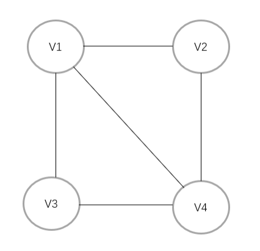
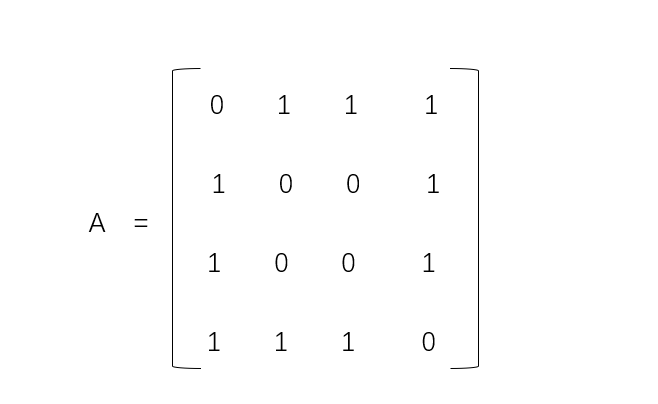
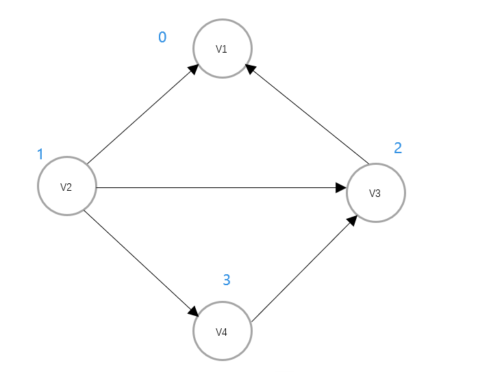
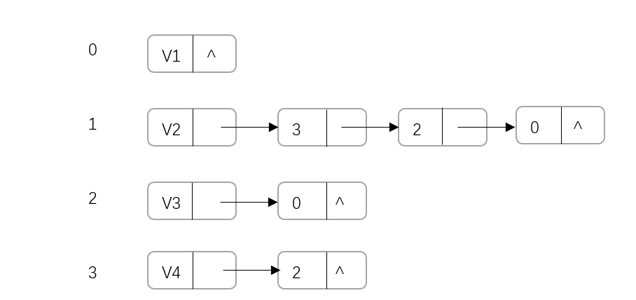

# 图论

## 图的简介

图是一种由【顶点vertex】和【边edge】组成的非线性数据结构。其中顶点可以和一条或多条边连接，边可以是有向的，也可以是无向的；边还可以有权重，也可以没有权重。根据这些差异，图大致被分为如下几类:


**图的常用术语:**

- 邻接(adjacency)： 当两个顶点之间有边相连时，我们称这两个顶点是邻接的。
- 路径(path): 顶点`v1`到顶点`v2`所经过的边构成的序列就叫做路径
- 度(degree): 一个顶点所拥有的边数。对于有向图，入度(in-degree)表示有多少条边指向该顶点，出度(out-degree)表示有多少条边从该顶点指出。

## 图的实现

图的存储方式一般有两种: 邻接矩阵和邻接表。下面分别介绍这两种存储方式。

### 邻接矩阵

使用一个二维数组 adj 来存边，其中 adj[u][v] 为 1 表示存在 u 到 v 的边，为 0 表示不存在。如果是带边权的图，可以在 adj[u][v] 中存储 u 到 v 的边的边权:



针对上图所示的无向图，使用邻接矩阵则表示为`4x4`的矩阵，比如第一行表示v1与v1、v2、v3、v4的关系，以此类推，效果如下图所示:



### 邻接表

使用一个支持动态增加元素的数据结构构成的数组，如 vector<int> adj[n + 1] 来存边，其中 adj[u] 存储的是点 u 的所有出边的相关信息（终点、边权等）:



针对上图所示的有向图，使用一个数组来存储各个顶点，其中下标是顶点的标号，值是顶点的邻接表(一个动态数组或者一个链表)，如下图所示:



如果顶点不适合使用数数字下标来表示，那么将顶点和边分开存储也是一样的效果，比如:

```json
{
	"vertexs": ["a", "b", "c"],
	"edges": {
		"a": ["b", "c"],
		"b": ["c"],
		"c": []
	}
}
```

### 对比

**图中共有n个顶点和m条边**

||邻接矩阵|邻接表|
|---|---|---|
|判断是否邻接|O(1)|O(m)|
|添加边|O(1)|O(1)|
|删除边|O(1)|O(m)|
|添加顶点|O(n)|O(1)|
|删除顶点|O(n^2)|O(n+m)|
|内存空间占用|O(n^2)|O(n+m)|

## 图的遍历

图的遍历方式一般分为两种，一个是广度优先遍历，一个是深度优先遍历，下面分别介绍这两种遍历方式。

### 广度优先遍历

广度优先是一种层次遍历，从图中的某个顶点出发，访问与这个顶点的边关联的所有顶点，这些顶点构成第一层；然后再访问这一层顶点的边关联的所有顶点，这些顶点构成第二层；以此类推，层层往外面扩，知道所有顶点被访问，这就是广度优先遍历。图示如下:


### 深度优先遍历

深度优先遍历顾名思义每次都是尽可能往深处走，直到不能再走为止，然后再回溯到上一个节点，再尽可能往深处走，直到所有节点都被访问。图示如下:


## 图的经典场景

### 有向无环图(DAG)与拓扑排序

有向无环图的性质是边有方向、无环, 如下图所示:


> 有向无环图的拓扑排序 [➡️](https://xie.infoq.cn/article/3b478d3129b642af3fe497f58)

### 最短路径

图中两个顶点之间的最短路径指的是从一个顶点到另外一个顶点所经过的边的权重总和最小的路径。最短路径问题是图论中的一个经典问题，常见的解决方法有 Dijkstra 算法和 Floyd 算法。

> Dijkstra算法 [➡️](https://www.freecodecamp.org/chinese/news/dijkstras-shortest-path-algorithm-visual-introduction/)
> Floyd算法 [➡️](https://houbb.github.io/2020/01/23/data-struct-learn-03-graph-floyd)

### 最小生成树

> 最小生成树算法 [➡️](https://zinglix.xyz/2017/09/06/mst/)