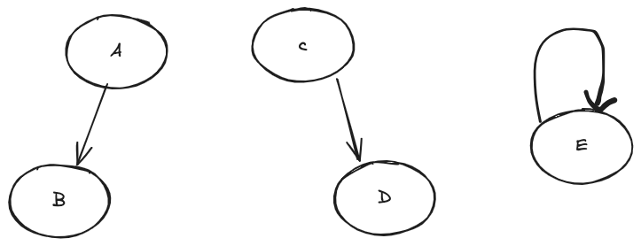
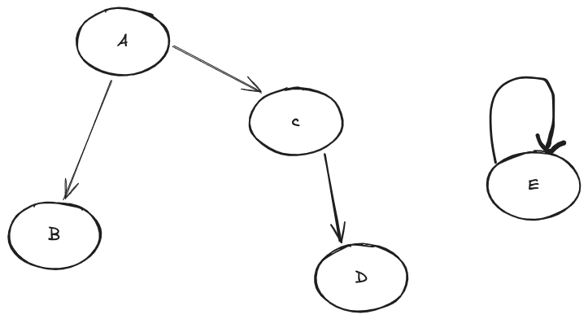

# 并查集

## 概述

并查集(Union Find)是一种树型结构，主要用于管理同属一个集合的元素，可以快速处理一些元素是否出现交集的问题。并查集主要支持两种操作：

- 合并(Union): 将两个元素合并为一个元素
- 查找(Find): 确定某个元素属于哪个集合(查询对应的树的根节点)。

**举一个例子:**

有A、B、C、D、E五个元素，初始时每个元素都是一个集合，即A、B、C、D、E分别是一个集合。现在要合并A和B，C和D, 那么现在就有A、C、E三个集合，显示如下:

此时我们要判断B、D有没有存在交集，就很好计算了，只需要分别查询B的根节点以及D的根节点，看看两者是否相等就可以判断是否有交集；此时我们再把这两个集合合并，形成一个更大的集合，那么就如下图:

此时我们如果要判断B、E有没有交集，就可以重复上述的过程。

并查集最常见的一个场景就是判断图中是否有环，比如在Kruskal算法中，就是利用并查集来判断图中是否有环；通过并查集，我们可以很方便的判断两个元素是否属于同一个集合，从而判断是否有环。

## 并查集的实现

并查集的实现主要有两种方式，一种是数组实现，一种是树实现。具体可以参考[👉并查集实现](https://algo.itcharge.cn/07.Tree/05.Union-Find/01.Union-Find/#_1-2-%E5%B9%B6%E6%9F%A5%E9%9B%86%E7%9A%84%E4%B8%A4%E7%A7%8D%E5%AE%9E%E7%8E%B0%E6%80%9D%E8%B7%AF)
