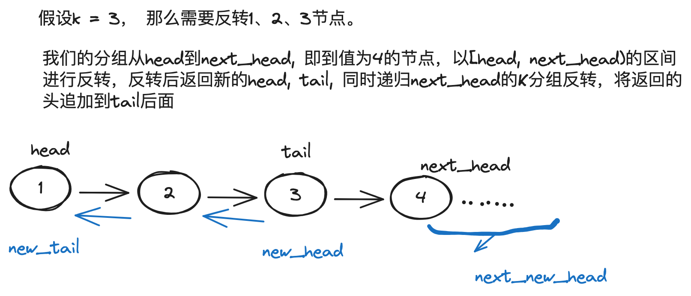
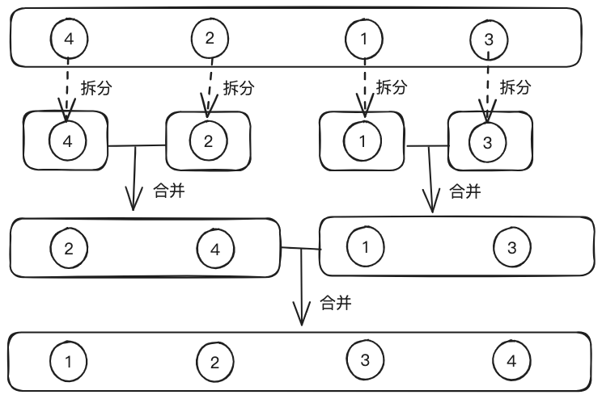

# 题解

## 数组相关算法题

### 1.两数之和

> [题目描述](https://leetcode-cn.com/problems/two-sum/)

**题目解法**: 遍历给定的数组，使用哈希表存储每一个(数值: 下标)的KV对, 然后再次遍历数组，通过查找哈希表中是否存在key为 `target - nums[i]` 的值，如果存在则返回对应的下标即可。

[rust版本](../../../codes/rust/1.两数之和.rs) |
[java版本](../../../codes/java/1.两数之和.java) |
[golang版本](../../../codes/golang/1.两数之和.go) |
[python版本](../../../codes/python/1.两数之和.py)

 

### 56.合并区间

> [题目描述](https://leetcode-cn.com/problems/merge-intervals/)

**题目解法**: 首先可以对给定的区间数组intervals先排序(按照start), 重叠的区间肯定选start最小的，而end选最大的，所以我们只需要遍历区间数组，每个区间和上一个区间对比是否重叠，如果重叠则更新end, 不重叠则将上一个区间加入结果数组中。

[rust版本](../../../codes/rust/56.合并区间.rs) |
[java版本](../../../codes/java/56.合并区间.java) |
[golang版本](../../../codes/golang/56.合并区间.go) |
[python版本](../../../codes/python/56.合并区间.py)

 

### 57.插入区间

> [题目描述](https://leetcode-cn.com/problems/insert-interval/)

**题目解法**: 对于一个已经按照区间起始端点排序好的区间列表，当要插入一个新的区间时，对比列表中的一个区间有三种情况:

1. 新区间和当前区间不重叠，同时新区间在当前区间左侧，那么在未插入过的情况下，直接将新区间插入到当前区间左侧即可。
2. 新区间和当前区间不重叠，同时新区间在当前区间右侧，那么则继续遍历下一个区间。
3. 新区间和当前区间重叠，那么则合并两个区间，同时将新区间的start和end更新，然后继续遍历下一个区间。
4. 如果遍历完所有区间都没有插入过，说明新区间是在最后一个区间的右侧，那么直接将新区间插入到最后即可。

[rust版本](../../../codes/rust/57.插入区间.rs) |
[java版本](../../../codes/java/57.插入区间.java) |
[golang版本](../../../codes/golang/57.插入区间.go) |
[python版本](../../../codes/python/57.插入区间.py)

 

### 41.缺失的第一个正数

> [题目描述](https://leetcode-cn.com/problems/first-missing-positive/)

**题目解法**: 该题目明确要求时间复杂度为\(O(n)\)并且只使用常数级别的额外空间，我们假设 nums 中的最大值为max_num，那么就可以将nums扩展为长度为max_num的数组，然后想办法让数组中的数值与下标值相等，最终找到第一个不相等的下标就是最小的正整数。
例子:
比如对于数组nums = [1,2,0], 其中nums[0] = 1, nums[1] = 2, nums[2] = 0
我们将每个下标和数值按照条件对应起来(我们规定下标 = 数值 -1)，步骤如下:

1. 我们找到下标为0的值为1, nums[nums[0]-1] = nums[0], 符合条件，此时数组为[1,2,0]
2. 我们继续找到下标为1的值为2, nums[nums[1]-1] = nums[1], 符合条件，此时数组为[1,2,0]
3. 我们继续找到下表为2的值为0, 0不在有效范围内，不符合条件，所以保持不变，最终数组为[1,2,0]
4. 重新再遍历数组，找到下标为2的值不符合条件，那么最小正整数位(2 + 1) = 3.

其中我们并不需要将数组大小扩展到max_num, 因为最小正整数肯定在[1, max_num + 1]之间，所以对于值为负数或者超过数组长度的数值我们不交换，直接跳过即可。 其中我们需要注意的是，我们判断依据是nums[nums[i]-1] 是否等于nums[i], 是因为我们需要当前i位置的值所对应的下标的值一定要等于i位置的值。

[rust版本](../../../codes/rust/41.缺失的第一个正数.rs) |
[java版本](../../../codes/java/41.缺失的第一个正数.java) |
[golang版本](../../../codes/golang/41.缺失的第一个正数.go) |
[python版本](../../../codes/python/41.缺失的第一个正数.py)

 

## 链表相关算法题

### 21.合并两个有序链表

> [题目描述](https://leetcode-cn.com/problems/merge-two-sorted-lists/)

**题目解法**: 可以使用双指针技巧，先创建一个虚拟头节点head和指针tail，并使用指针tail指向head, 同时使用两个指针分别指向两个链表的头节点。现在分别移动两个指针，每次都将较小的节点加入到tail指针的后面，直到其中一个链表为空，然后将另一个链表剩余的节点加入到tail指针的后面即可。

[rust版本](../../../codes/rust/21.合并两个有序链表.rs) |
[java版本](../../../codes/java/21.合并两个有序链表.java) |
[golang版本](../../../codes/golang/21.合并两个有序链表.go) |
[python版本](../../../codes/python/21.合并两个有序链表.py)

 

### 23.合并K个升序链表

> [题目描述](https://leetcode-cn.com/problems/merge-k-sorted-lists/)

**题目解法**: 该题目是合并两个有序链表的升级版，从合并两个变成合并K个，我们可以使用分治的思想，将K个链表分成两部分，然后分别合并，最后再将两个合并后的链表合并即可。这样的时间复杂度为O(klogk), 空间复杂度为O(logk)。

更好的方式是使用最小堆来解决，我们可以创建一个K大小的最小堆，然后将K个链表的头节点加入到最小堆中，然后每次从最小堆中取出最小的节点，将该节点加入到结果链表中，同时将该节点的下一个节点加入到最小堆中，直到最小堆为空。

[rust版本](../../../codes/rust/23.合并-k-个升序链表.rs) |
[java版本](../../../codes/java/23.合并-k-个升序链表.java) |
[golang版本](../../../codes/golang/23.合并-k-个升序链表.go) |
[python版本](../../../codes/python/23.合并-k-个升序链表.py)

 

### 25.K个一组翻转链表

> [题目描述](https://leetcode-cn.com/problems/reverse-nodes-in-k-group/)

**题目解法**: 在思考这道题目之前，我们想一想反转链表题目，反转链表我们一共用了三个指针(prev, curr, next), 然后每次都将curr节点的后继指针指向prev, 然后再将prev指向curr、curr指向next、next指向next的后继节点。于是我们可以在此基础上，将链表分成若干个长度为k的子链表，然后对每个子链表
进行反转，最后再使用尾指针将所有子链表连接起来即可。

链表分组反转再连接的流程大致如下:

[rust版本](../../../codes/rust/25.k-个一组翻转链表.rs) |
[java版本](../../../codes/java/25.k-个一组翻转链表.java) |
[golang版本](../../../codes/golang/25.k-个一组翻转链表.go) |
[python版本](../../../codes/python/25.k-个一组翻转链表.py)

 

### 83.删除排序链表中的重复元素

> [题目描述](https://leetcode-cn.com/problems/remove-duplicates-from-sorted-list/)

**题目解法**: 使用双指针技巧:

1. 初始化fast、slow指针都指向head
2. 不断移动fast往后继节点移动，直到找到fast.val != slow.val, 此时如果slow和fast之间有节点，说明这些中间节点和slow重复，我们可以通过slow.next = fast来直接删除中间节点
3. 然后slow指向fast, 重复第2步，直到fast为null

[rust版本](../../../codes/rust/83.删除排序链表中的重复元素.rs) |
[java版本](../../../codes/java/83.删除排序链表中的重复元素.java) |
[golang版本](../../../codes/golang/83.删除排序链表中的重复元素.go) |
[python版本](../../../codes/python/83.删除排序链表中的重复元素.py)

 

### 82.删除排序链表中的重复元素II

> [题目描述](https://leetcode-cn.com/problems/remove-duplicates-from-sorted-list-ii/)

**题目解法**: 该题相比第`82`题目，不同的点是该题目需要整个删除出现重复的节点。我们可以通过比较node和node.next的值来判断当前节点是否为重复节点，同时我们可以新增一个prev指针来指向当前节点的前继节点，然后通过prev.next = 【下一个不重复的节点】来删除掉所有重复的节点。

[rust版本](../../../codes/rust/82.删除排序链表中的重复元素-ii.rs) |
[java版本](../../../codes/java/82.删除排序链表中的重复元素-ii.java) |
[golang版本](../../../codes/golang/82.删除排序链表中的重复元素-ii.go) |
[python版本](../../../codes/python/82.删除排序链表中的重复元素-ii.py)

 

### 206.反转链表

> [题目描述](https://leetcode-cn.com/problems/reverse-linked-list/)

**题目解法**: 使用多指针技巧，定义三个指针prev, curr, next, 然后不断移动这三个指针，每次都将curr.next指向prev来实现反转，然后再移动三个指针直到curr为null。

[rust版本](../../../codes/rust/206.反转链表.rs) |
[java版本](../../../codes/java/206.反转链表.java) |
[golang版本](../../../codes/golang/206.反转链表.go) |
[python版本](../../../codes/python/206.反转链表.py)

 

### 92.反转链表II

> [题目描述](https://leetcode-cn.com/problems/reverse-linked-list-ii/)

**题目解法**: 该题目是需要反转链表中索引[left..right]区间的节点，我们可以先找到`left-1`索引位置的节点，然后将`left`索引位置的节点作为链表
头，反转`k = right-left`个节点(需要考虑将`left + k + 1`索引的节点接入到反转链表后)， 然后将得到的新的头接入到`left-1`索引位置的节点的后继节点即可.

[rust版本](../../../codes/rust/92.反转链表-ii.rs) |
[java版本](../../../codes/java/92.反转链表-ii.java) |
[golang版本](../../../codes/golang/92.反转链表-ii.go) |
[python版本](../../../codes/python/92.反转链表-ii.py)

 

### 148.排序链表

> [题目描述](https://leetcode-cn.com/problems/sort-list/)

**题目解法**: 当链表只有一个节点的时候，其默认就是有序的, 所以该题目我们可以采用分治 + 归并的思想来解决。首先我们可以将链表拆分为N个只有一个节点的链表，然后自底向上对这些链表进行两两合并，最终得到一个有序的链表。

[rust版本](../../../codes/rust/148.排序链表.rs) |
[java版本](../../../codes/java/148.排序链表.java) |
[golang版本](../../../codes/golang/148.排序链表.go) |
[python版本](../../../codes/python/148.排序链表.py)
