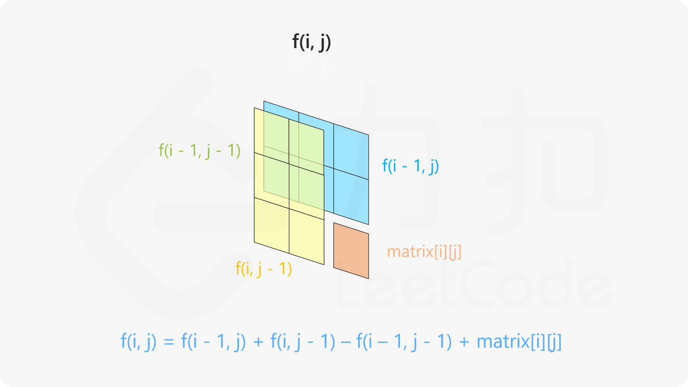
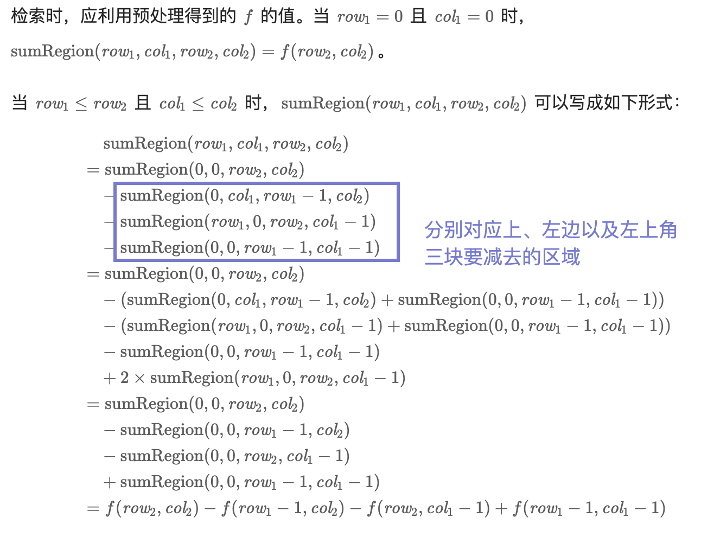

# 题解

## 560. 和为K的子数组

[原题链接](https://leetcode-cn.com/problems/subarray-sum-equals-k/)

**题目解法:** 该题目可以通过前缀和 + 哈希表来解决，思路如下:

1. 首先我们维护一个哈希表，其中: key是前缀和，value是该前缀和对应的下标个数
2. 然后我们遍历数组，每次遍历到一个元素，将前一个元素的前缀和加上当前元素的值，得到当前元素的前缀和，然后将当前元素的前缀和存入哈希表中(对值累计)
3. 接着我们将当前前缀和减去目标值，得到一个值，然后我们去哈希表中查找是否存在这个值，如果存在，那么就说明存在一个子数组的和为目标值，然后我们将这个子数组的个数加入到结果中
4. 最终遍历完数组我们就得到了子数组的个数

[rust版本](../../../codes/rust/560.和为-k-的子数组.rs) |
[java版本](../../../codes/java/560.和为-k-的子数组.java) |
[golang版本](../../../codes/golang/560.和为-k-的子数组.go) |
[python版本](../../../codes/python/560.和为-k-的子数组.py)

## 303. 区域和检索 - 数组不可变

[原题链接](https://leetcode-cn.com/problems/range-sum-query-immutable/)

**题目解法:**  该题目的解决思路如下，类`NumArray`维护一张哈希表，存储`nums`中每个元素的前缀和，初始化该类的时候将`nums`中每个元素的前缀和存入哈希表中，然后在`sumRange`方法中，我们只需要通过`end`下标去哈希表中查找对应的前缀和，然后减去`start`下标对应的前缀和即可得到结果

[rust版本](../../../codes//rust/303.区域和检索-数组不可变.rs) |
[java版本](../../../codes/java/303.区域和检索-数组不可变.java) |
[golang版本](../../../codes/golang/303.区域和检索-数组不可变.go) |
[python版本](../../../codes/python/303.区域和检索-数组不可变.py)

## 304. 二维区域和检索 - 矩阵不可变

[原题链接](https://leetcode-cn.com/problems/range-sum-query-2d-immutable/)

**题目解法:** 该题目是303的进阶题目，解决思路如下:

类`NumMatrix`维护一张哈希表，存储`matrix`中每个元素的前缀和，存储方式如下:

1. 首先我们遍历`matrix`的每一行，然后对每一行进行前缀和计算，得到每一行的前缀和哈希表
2. 然后我们遍历每一列，对每一列进行前缀和计算，得到每一列的前缀和
3. 最后根据sumRegion中的行与行的差来遍历每一行，然后找到每一行中对应列的和(通过前缀和相减算出)，最后累加每一行的和即可得到结果。

上述解决思路在`sumRegino`方法中的时间复杂度为O(n)，有没有方法在O(1)的时间复杂度内解决该问题呢？有，解决思路如下:

以最小的2x2矩阵为例，右下角的元素加上上方的前缀和`pre_sum_map[i-1][j]`等于是将除了最后一行的其他行的和都加上了，然后再加上左边的前缀和`pre_sum_map[i][j-1] - pre_sum_map[i-1][j-1]`(排除其他行的干扰)等于是将最后一行的其他列的和都加上了，最终再加上自身的值，就得到了整个矩阵的和。拓展到更大的矩阵也是同样的原理，于是计算矩阵中一个元素的前缀和公式如下:

f(i,j) = f(i-1,j) + f(i,j-1) - f(i-1,j-1) + matrix[i][j]

图示:

以此为基础，我们初始化时计算整个`matrix`的前缀和，然后在`sumRegion`方法中，计算区域和时公式如下:

归纳为:

sumRegion(row_1, col_1, row_2, col_2) = f(row_2,col_2) - f(row_1-1,col_2) - f(row_2,col_1-1) + f(row_1-1,col_1-1)

[rust版本](../../../codes/rust/304.二维区域和检索-矩阵不可变.rs) |
[java版本](../../../codes/java/304.二维区域和检索-矩阵不可变.java) |
[golang版本](../../../codes/golang/304.二维区域和检索-矩阵不可变.go) |
[python版本](../../../codes/python/304.二维区域和检索-矩阵不可变.py)
