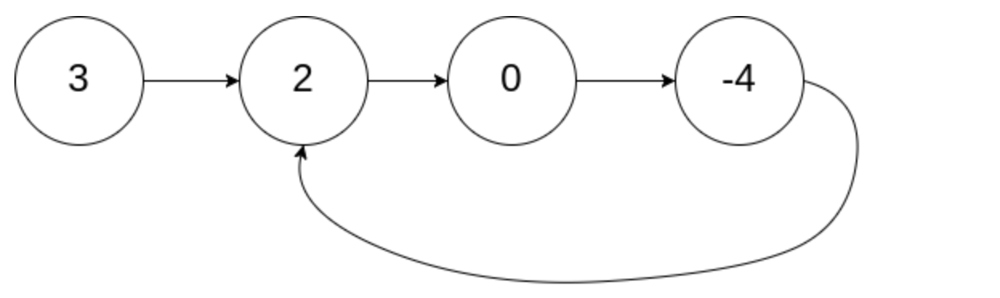

# 题解

## 5.最长回文子串

> [题目描述](https://leetcode-cn.com/problems/longest-palindromic-substring/)

**题目解法**: 该题目我们可以拆解为两个过程，一个是判断回文传，一个是如何分解字符串为子串。

- 判断回文串我们可以使用双指针技巧，从字符串的两端向中间遍历，如果最终指针指向的字符都相同，则该字符串为回文串。
- 我们可以使用双循坏暴力遍历字符串，找到所有的子串，然后判断是否为回文串，最终找到最长的回文串。

但是上面的解法时间复杂度比较高，**假设两层for循环的时间复杂度是**`O(n^2)`,再加上判断回文串的时间复杂度`O(n)`,那么总的时间复杂度就是`O(n^3)`。为了进一步优化，我们可以将双循环的暴力遍历想办法优化为一层循坏，我们假设当前遍历到的字符为`i`,那么我们可以从`i`开始向两边扩散，判断是否为回文串，这样的话时间复杂度就是`O(n^2)`。步骤如下:

- 从左向右遍历字符串，假设当前遍历到的字符为`i`，那么开始求以`i`为中心的最长回文串是多少。
- 以`i`为中心有两种情况:
  - i是奇数子串的中心，那么以`i`为中心的最长回文串就是`i`向两边扩散，直到不是回文串为止。
  - i是偶数子串的中心，那么以`i`为中心的最长回文串就是`i`和`i+1`向两边扩散，直到不是回文串为止。
- 将上面两种情况的最长回文串长度进行比较，取最大值为以`i`为中心的最长回文串。
- 然后不断对比更新每个`i`为中心的最长回文串长度，最终得到最长回文串。

[rust版本](../../../codes/rust/5.最长回文子串.rs) |
[java版本](../../../codes/java/5.最长回文子串.java) |
[golang版本](../../../codes/golang/5.最长回文子串.go) |
[python版本](../../../codes/python/5.最长回文子串.py)

 

## 88.合并两个有序数组

> [题目描述](https://leetcode-cn.com/problems/merge-sorted-array/)

**题目解法**: 该题目同样可以使用双指针技巧，我们可以用`i`指针指向`nums1`的最后一个元素，`j`指针指向`nums2`的最后一个元素，`p`指针指向`nums1`的最后一个位置(`num1`预留m+n的空间，所以`p`最开始等于m+n-1)，然后从后向前遍历，将较大的元素放到`p`指针位置，然后不断更新`i`或者`j`指针以及`p`指针，直到遍历完`nums1`或者`nums2`。如果最终`nums2`还有剩余元素，那么直接将`nums2`的元素放到`nums1`的前面即可。

[rust版本](../../../codes/rust/88.合并两个有序数组.rs) |
[java版本](../../../codes/java/88.合并两个有序数组.java) |
[golang版本](../../../codes/golang/88.合并两个有序数组.go) |
[python版本](../../../codes/python/88.合并两个有序数组.py)

 

## 26.删除有序数组中的重复项

> [题目描述](https://leetcode-cn.com/problems/remove-duplicates-from-sorted-array/)

**题目解法**: 题目可以使用双指针技巧解决，初始化slow和fast指针指向数组的第一个元素，然后移动fast指针直到nums[fast] > nums[slow]，然后赋值nums[slow+1] = nums[fast]并更新slow = slow +1; 接着继续移动fast指针，直到遍历完整个数组，此时的slow指针指向的就是去重后的数组的最后一个元素。

[rust版本](../../../codes/rust/26.删除有序数组中的重复项.rs) |
[java版本](../../../codes/java/26.删除有序数组中的重复项.java) |
[golang版本](../../../codes/golang/26.删除有序数组中的重复项.go) |
[python版本](../../../codes/python/26.删除有序数组中的重复项.py)

 

## 27.移除元素

> [题目描述](https://leetcode-cn.com/problems/remove-element/)

**题目解法**: 该题可以使用双指针技巧，初始化slow和fast指针指向数组的第一个元素，然后开始不断移动fast指针直到末尾，如果nums[fast] != val, 则同步更新slow指针移动和nums[slow] = nums[fast]; 如果nums[fast] == val, 此时只需要移动fast指针即可，因为此时slow指针刚好就指向需要被删除的元素，在下一次的nums[fast] != val 判断中，slow指向的需要被删除的值刚好就会被覆盖掉。

[rust版本](../../../codes/rust/27.移除元素.rs) |
[java版本](../../../codes/java/27.移除元素.java) |
[golang版本](../../../codes/golang/27.移除元素.go) |
[python版本](../../../codes/python/27.移除元素.py)

 

## 42.接雨水

> [题目描述](https://leetcode-cn.com/problems/trapping-rain-water/)

**题目解法**: 该题目可以利用双指针技巧实现，通过分析题目我们可以知道一根柱子能接收多少水是根据柱子左右两边的最大值来决定的，`柱子i的接水量 = min(i_left_max, i_right_max) - height[i]`。 所以比较直接的解法是遍历每根柱子，然后从柱子的左右两侧去寻找左右最大值，以此就可以算出柱子的接水量，其中遍历柱子的时间复杂度是`O(n)`，每根柱子从左右两侧寻找最大值时间复杂度也是`O(n)`，所以总的时间复杂度是`O(n^2)`;

当然我们可以进一步优化，我们可以通过备忘录的方式先记录每根柱子的左右最大值，然后再遍历每根柱子，这样的话时间复杂度就是`O(n)`。

[rust版本](../../../codes/rust/42.接雨水.rs) |
[java版本](../../../codes/java/42.接雨水.java) |
[golang版本](../../../codes/golang/42.接雨水.go) |
[python版本](../../../codes/python/42.接雨水.py)

 

## 15.三数之和

> [题目描述](https://leetcode-cn.com/problems/3sum/)

**题目解法**:

- 首先让我们设想一下最暴力的解法，那就是对数组进行三层循环，然后判断三个数的和是否为0，如果为0则加入到结果集中，这样的话时间复杂度就是`O(n^3)`，并且三个数的组合是有重复的，需要使用额外的空间进行判重，显然是不可取的。
- 让我们换一个思路，我们可以先对数组进行排序，然后固定住一个数`num`(三数中的最小值)，接下来只需要往后寻找两数之和为`-num`的另外两个数就好了。同时我们在找数的过程中通过和上一次的数值对比是否相等来判断是否是重复的组合，最后将满足条件的组合加入到结果集中。

[rust版本](../../../codes/rust/15.三数之和.rs) |
[java版本](../../../codes/java/15.三数之和.java) |
[golang版本](../../../codes/golang/15.三数之和.go) |
[python版本](../../../codes/python/15.三数之和.py)

 

## 18.四数之和

> [题目描述](https://leetcode-cn.com/problems/4sum/)

**题目解法**: 该题目我们可以参考三数之和，同样可以先固定一个值，然后求三数之和，接着继续递归求二数之和。抽取其共性，我们就可以得到一个通用的`n数之和`的解法。

[rust版本](../../../codes/rust/18.四数之和.rs) |
[java版本](../../../codes/java/18.四数之和.java) |
[golang版本](../../../codes/golang/18.四数之和.go) |
[python版本](../../../codes/python/18.四数之和.py)

 

## 234.回文链表

> [题目描述](https://leetcode-cn.com/problems/palindrome-linked-list/)

**题目解法**:  因为是单链表，我们无法用双指针做相向或相背遍历对比，所以我们考虑从链表的中点出发，将链表的后半部分进行反转，然后再从链表的头部和中点开始同时遍历，对比两个链表的值是否相等，如果相等则是回文链表，否则不是回文链表。

[rust版本](../../../codes/rust/234.回文链表.rs) |
[java版本](../../../codes/java/234.回文链表.java) |
[golang版本](../../../codes/golang/234.回文链表.go) |
[python版本](../../../codes/python/234.回文链表.py)

 

## 19.删除链表的倒数第N个节点

> [题目描述](https://leetcode-cn.com/problems/remove-nth-node-from-end-of-list/)

**题目解法**: 题目进阶要求只扫描一遍来解决，我们同样可以使用快慢指针来实现，首先`fast`指针指向头节点并先走`n+1`步(多走一步是因为我们最终需要的是指向倒数第n+1个节点来操作)，然后再让`slow`指针指向头节点，然后`fast`和`slow`一起往后移动，直到`fast`指向空，此时`slow`就指向倒数第n个节点的前一个节点，然后我们只需要将`slow.next = slow.next.next`即可。注意我们需要从一个虚拟节点开始，这样当删除的倒数节点是头节点时，我们也可以正常处理。

[rust版本](../../../codes/rust/19.删除链表的倒数第N个节点.rs) |
[java版本](../../../codes/java/19.删除链表的倒数第N个节点.java) |
[golang版本](../../../codes/golang/19.删除链表的倒数第N个节点.go) |
[python版本](../../../codes/python/19.删除链表的倒数第N个节点.py)

 

## 141.环形链表

> [题目描述](https://leetcode-cn.com/problems/linked-list-cycle/)

**题目解法**: 该题目是双指针技巧的经典题了，我们可以使用快慢指针来解决，其中`slow`每次走一步，`fast`每次走两步，如果链表有环的话，那么`fast`指针一定会追上`slow`指针，如果链表没有环的话，那么`fast`指针一定会先指向空。

我在参考其他题解的时候，一直对为什么`fast`指针每次走两步，`slow`指针每次走一步，`fast`指针一定会追上`slow`指针这个结论有点疑惑，为此我使用题目描述中的`示例1`再证明一下:

因为`fast`每次总是比`slow`多移动一次，所以当`slow`走了`k`步，那么`fast`就走了`2k`步，当`slow`第一次走到成环的节点即回到`2`节点时, `fast`因为先在环里面打转，现在肯定在环中的某个节点上(比如此时fast就在`0`节点上)，此时我们可以看到`fast`到`slow`的距离也就是就是2次，而`fast`每次都比`slow`多走一步，所以只要`slow`和`fast`按照自己的步数再走两次，那么距离就变成了0，也就是在-4节点这里相遇了。

[rust版本](../../../codes/rust/141.环形链表.rs) |
[java版本](../../../codes/java/141.环形链表.java) |
[golang版本](../../../codes/golang/141.环形链表.go) |
[python版本](../../../codes/python/141.环形链表.py)

 

## 142.环形链表II

> [题目描述](https://leetcode-cn.com/problems/linked-list-cycle-ii/)

**题目解法**: 我们假设`slow`和`fast`指针相遇的时候，`slow`走了K步，那么`fast`一定走了2 * K步， 其中`fast`比`slow`多出来的这K步肯定是在环里面绕圈圈，所以K肯定是这个环的长度的整数倍(即`fast`从相遇点出发走一圈或者几圈又回到相遇点)。

此时我们假设`detect`成环点与相遇点的距离是M, 那么从head走到相遇点的距离是K，那么从head走到`detect`成环点的距离就是K-M, 巧妙的是，如果同时一个指针从相遇点出发经过K步会回到相遇点，那么少走M步刚好也可以到`detect`成环点，当然这个指针可能会多绕环一两圈或者就一圈，这个我们不必在意，重要的是一个指针从head出发走`K-M`步，和另外一个指针从相遇点出发走`k-M`步，他们会在`detect`成环点相遇，于是`detect`节点我们就可以计算得出了。

[rust版本](../../../codes/rust/142.环形链表-ii.rs) |
[java版本](../../../codes/java/142.环形链表-ii.java) |
[golang版本](../../../codes/golang/142.环形链表-ii.go) |
[python版本](../../../codes/python/142.环形链表-ii.py)

 

## 86.分隔链表

> [题目描述](https://leetcode-cn.com/problems/partition-list/)

 

## 167.两数之和II-输入有序数组

> [题目描述](https://leetcode-cn.com/problems/two-sum-ii-input-array-is-sorted/)

 

## 283.移动零

> [题目描述](https://leetcode-cn.com/problems/move-zeroes/)

 

## 344.反转字符串

> [题目描述](https://leetcode-cn.com/problems/reverse-string/)

 
